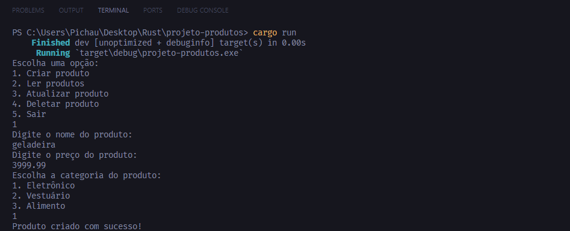

# Estoque de Produtos - CRUD em Rust

## Como utilizar

Ao executar o comando "cargo run" no terminal será mostrada uma CLI com 5 opções, Criar, Ler, Atualizar, Deletar e Sair. Todas as informações são salvas dentro de um documento de texto chamado "produtos.txt" (caso não exista ainda, será criado um novo). O arquivo contem 3 informações sobre o produto: nome, preço e tipo (1 - Eletronico, 2 - Vestuario, 3 - Alimento). São colocados dentro no arquivo texto no formato: "{nome}, {valor}, {tipo}".

